# Machine Learning Trading Bot

## Establish a Baseline Performance
I use the SVC classifier model from SKLearn's support vector machine (SVM) learning method to fit the training data and make predictions based on the testing data. The results are shown below graph:

 

SVM prediction was better than the actual result with 3 months of test data and SMA_Short= 4 days and SMA_Long = 100.

## Tune the Baseline Trading Algorithm
In this section, I tuned the model’s input features to find the parameters that result in the best trading outcomes. 

### 1-  Size of training dataset
Tune the training algorithm by adjusting the size of the training dataset. To do so, slice your data into different periods. 
* 6 months DateOffset
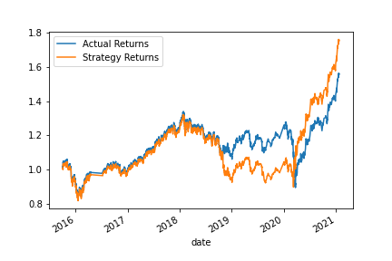 

* 1 month DateOffset
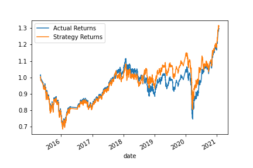 

What impact resulted from increasing or decreasing the training window?
* As you see in the above graphs both of DateOffset have a worse result than 3 months DateOffset.  

### 2- SMA input features 
Tune the trading algorithm by adjusting the SMA input features. Adjusted one or both of the windows for the algorithm as below: 

* SMA_Short:2 SMA_long:100
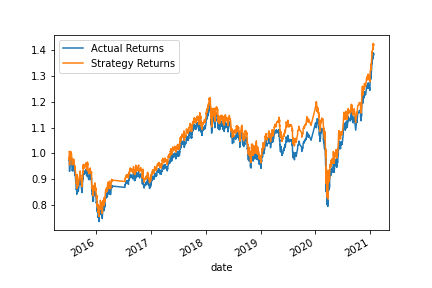 

* SMA_Short:5 SMA_long:100
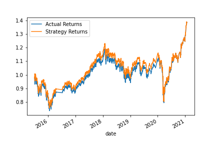 

* SMA_Short:10 SMA_long:100
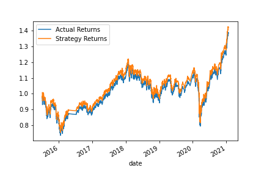 

* SMA_Short:3 SMA_long:60
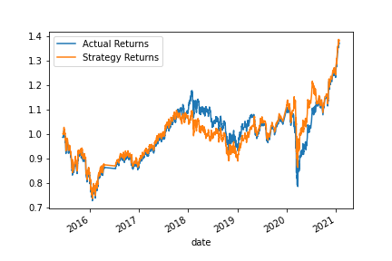 

* SMA_Short:10 SMA_long:200
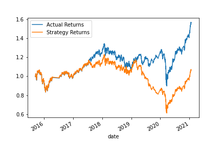 

* SMA_Short:3 SMA_long:50
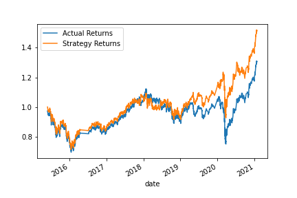 

* SMA_Short:4 SMA_long:40
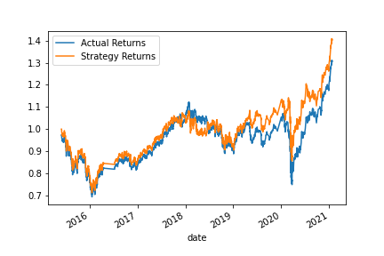 

Best Reult:
* SMA_Short:3 SMA_long:100
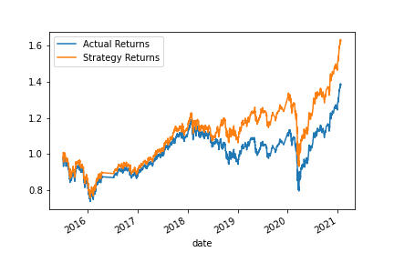 

What impact resulted from increasing or decreasing either or both of the SMA windows?

* Most of the tested window sizes had a worse result and only I found SMA_Short:3 SMA_long:100 with a better result that has a close parameter to the first iteration. 

   
## Evaluate a New Machine Learning Classifier
Import and fit diffrent classifier modeles, such as AdaBoost, DecisionTreeClassifier, and LogisticRegression and compare results with SVM model and actual result.

* All Models Returns 
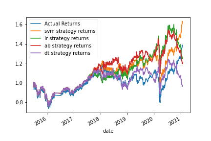 

* LogisticRegression Model Returns
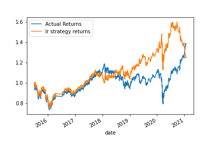 

* AdaBoost Model Returns 
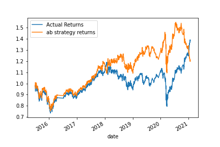 

* DecisionTreeClassifier Model Returns 
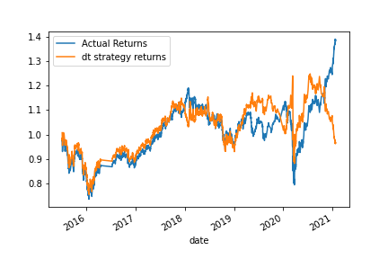 

* SVM Models Returns 
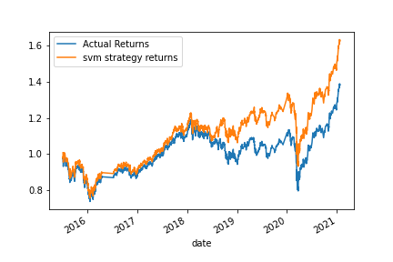

Did this new model perform better or worse than the provided baseline model? Did this new model perform better or worse than your tuned trading algorithm?
* SMV Model has better results with tuned parameter.

## Files
* [Notebook](machine_learning_trading_bot.ipynb) 
